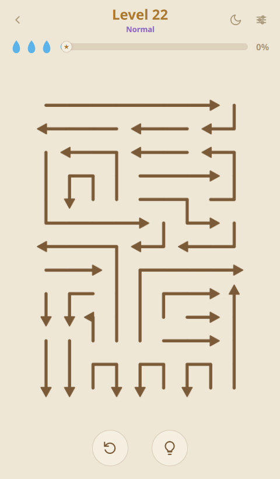
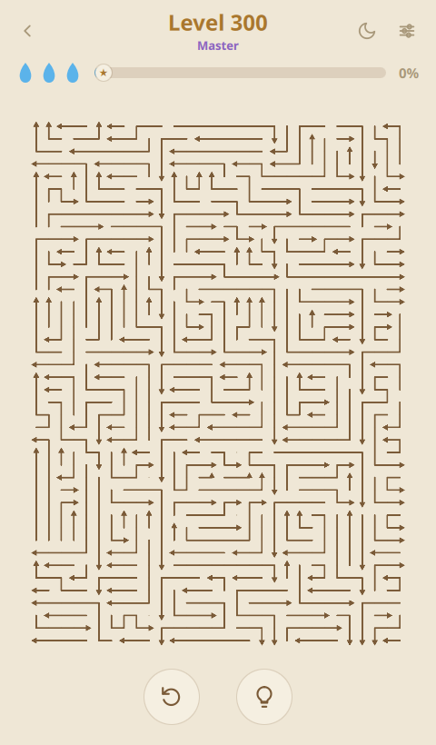
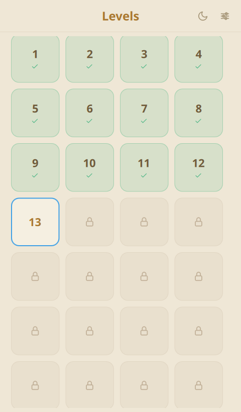

# ArrowEscape — A Calm Arrow-Untangling Puzzle for Linux

  

ArrowEscape is a calm, meditative logic puzzle for your Linux desktop. Every board
is a tightly packed tangle of arrows — tap one to slide it off the edge in the
direction it points, but only when its path is clear. Find the right order, unpick
the tangle, and clear the board. Simple rules, deep strategy, no timer.

## Features

- Hundreds of hand-tight, fully-packed puzzles that always have a solution
- Difficulty that climbs from a gentle Easy start to a huge, deeply tangled Master board
- Satisfying slide-off animation and a soft piano soundtrack you can turn on or off
- Zoomable, pannable board so the biggest levels stay easy to read
- Light and dark themes; progress and preferences are saved automatically
- Fully offline — play anywhere, anytime

## Screenshots

## Links

- Product page: https://ktechpit.com/USS/public/product.php?slug=arrowescape
- More apps by KTechpit: https://ktechpit.com/USS/public/products.php

## About this repository

This repository hosts packaging metadata and store assets (icons, screenshots and
the featured banner) for **ArrowEscape**
